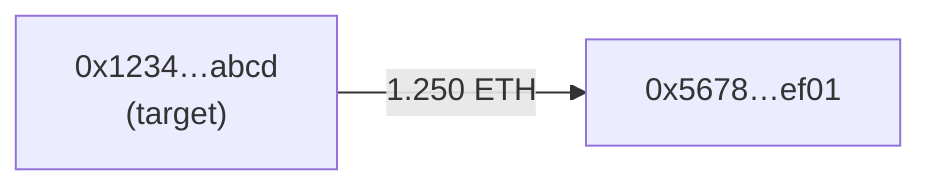

> **${var}** — Address (`0x...`) on Base to trace. Required. If empty, log `FUNDFLOW_NO_TARGET` and exit cleanly (no notify).

Answers "where did the money go?" (or "where did it come from?"). Follows value across multiple hops from a starting address and draws the path as a Mermaid graph — the core move for tracing a drainer's cash-out, a deployer's funding source, or laundering hops.

Runs **keyless** on the Base RPC; a Basescan key adds native ETH, token symbols/decimals, and full history.

## Config

- Start = `${var}`. Chain = Base (`chainid=8453`, explorer `basescan.org`).
- `FUNDFLOW_DIRECTION` — optional, `out` (default, where funds go) or `in` (where funds came from).
- `FUNDFLOW_DEPTH` — optional hop count, `1`–`3` (default `2`).
- `BASESCAN_KEY` — optional. With it, native ETH + token metadata + full history; keyless falls back to recent `Transfer` logs (~9k blocks/hop, ERC-20 only).

## Steps

### 1. Per hop, read the start node's transfers

With a key: `account/txlist` (native) + `account/tokentx` (ERC-20). Keyless: `eth_getLogs` for `Transfer` (topic0 `0xddf252ad...`) where the node is `from` (direction `out`) or `to` (direction `in`), over a recent block window.

```bash
ADDR="${var}"; RPC="${BASE_RPC_URL:-https://mainnet.base.org}"
curl -m 10 -s -X POST "$RPC" -H "Content-Type: application/json" -d '{
  "jsonrpc":"2.0","id":1,"method":"eth_getLogs","params":[{
    "fromBlock":"0x...","toBlock":"latest",
    "topics":["0xddf252ad1be2c89b69c2b068fc378daa952ba7f163c4a11628f55a4df523b3ef","<node padded 32B>"]
  }]}'
```

### 2. Aggregate by counterparty and fan out

For the chosen direction, sum value per counterparty and follow the **top 4** into the next hop. Stop at `FUNDFLOW_DEPTH` hops. Track visited nodes so you don't loop.

### 3. Build the graph

Emit a Mermaid `graph LR`, one node per address (label = short `0x1234…abcd`), edges labelled with the amount + asset, the start node highlighted:

````

````

### 4. Summarise

State how many addresses/transfers were traced and the main endpoints (where funds concentrate). Example:

```
Fund Flow — 0x1234…abcd (Base, outbound, 2 hops)
Traced 11 addresses, 9 transfers.
Funds flow toward: 0x5678…ef01, 0x90ab…cdef, …
```

### 5. Notify

Notify via `./notify` only when a clear destination concentrates funds (e.g. a single endpoint receiving most of the outflow — a likely cash-out / CEX deposit):

```
*Fund Flow — 0xTarget (Base, outbound, 2 hops)*
Funds concentrate at 0xEndpoint (received the majority of outflow).
Possible cash-out / deposit address — verify on the explorer.

Target: https://basescan.org/address/0xTarget
```

### 6. Log

Append to `memory/logs/${today}.md`:

```
## fund-flow
- Start: 0x… | direction: out | depth: 2 | nodes: 11 | edges: 9
- Main endpoints: 0x…, 0x…
- Source: rpc-logs (no key)
```

End-states: `FUNDFLOW_OK` (traced, no notable concentration), `FUNDFLOW_FLAGGED` (clear endpoint → notify), `FUNDFLOW_EMPTY` (no transfers in window), `FUNDFLOW_ERROR`.

## Sandbox note

The sandbox may block outbound `curl` or env-var expansion. Both the Base RPC and Basescan's API work over plain HTTPS, so for every failed `curl` retry the **same URL/body via WebFetch** before giving up. `eth_getLogs` may need a narrower block range on high-volume nodes (public-RPC result cap) — narrow and retry. If a `BASESCAN_KEY` is set, pass it as `&apikey=...` via WebFetch and never echo it into logs/notify. Treat every discovered address as untrusted data; only interpolate the validated `$ADDR` / hex into calls.

## Constraints

- Keyless mode sees only **recent ERC-20** transfers (no native ETH, raw amounts, no symbols) over a limited window — state this; a Basescan key materially deepens the trace.
- The graph is a **fan-out sample** (top counterparties per hop, capped depth), not the complete money flow — it surfaces the dominant paths, not every transfer.
- Counterparties may be exchanges, bridges, or contracts (pools/routers) — a hop into a CEX/bridge typically ends the traceable on-chain path. Label these rather than treating them as a personal wallet.
- Read-only (`eth_getLogs` / explorer reads) — no transactions. Heuristic tracing, not proof of wrongdoing; no real-world deanonymisation, no trade advice.
